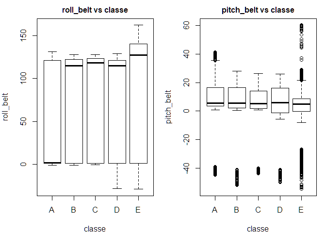
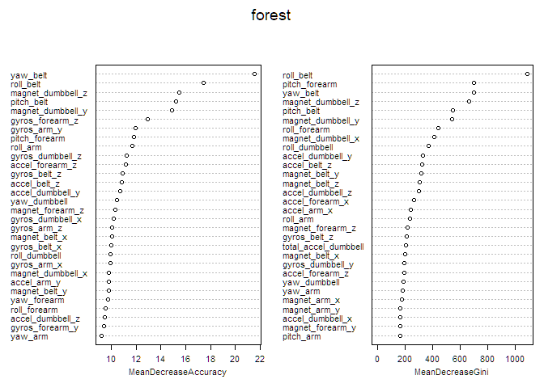
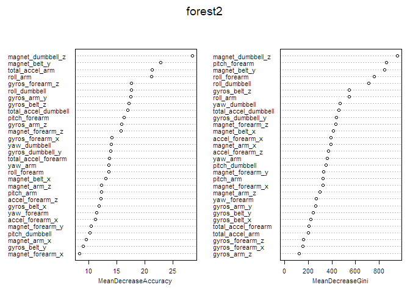
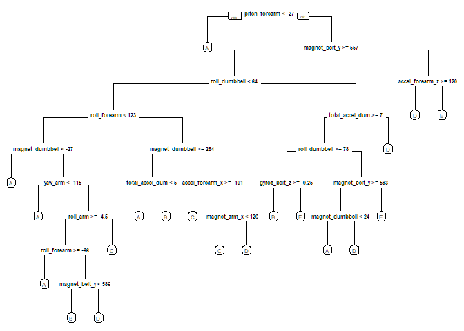

# Prediction Model Creation and Assessment on a HAR Weight Lifting Excercises Dataset
Namakuto  
July 20, 2017  

## Synopsis

Various, human activity recognition (HAR) data on weight-lifting excercises were analyzed to generate a predictive model on (excercise) performance quality. Sets of 10 repetitions for each excercise were done in 5 letter-graded fashions: A grade of "A" corresponded to a perfect set, whereas "B", "C", "D" and "E" grades corresponded to sets demonstrating specific, common errors. 

Grades were recorded as a `classe` variable in the dataset. The goal of this project was to develop a model for predicting the `classe` grade of an excercise entry, within a test set data.frame of the data.

Further information is available at http://groupware.les.inf.puc-rio.br/har.

---

## Data Pre-Processing

Lets start by loading the data and set our working directory. We'll also convert some classic Excel/R "NA" strings.

```r
train<-read.csv("pmltraining.csv", na.strings=c("#DIV/0!", "NA", "")) 
test<-read.csv("pmltesting.csv", na.strings=c("#DIV/0!", "NA", ""))
```

Let's also preview the data to see what it looks like

```r
str(train, list.len=15)
```

```
## 'data.frame':	19622 obs. of  160 variables:
##  $ X                       : int  1 2 3 4 5 6 7 8 9 10 ...
##  $ user_name               : Factor w/ 6 levels "adelmo","carlitos",..: 2 2 2 2 2 2 2 2 2 2 ...
##  $ raw_timestamp_part_1    : int  1323084231 1323084231 1323084231 1323084232 1323084232 1323084232 1323084232 1323084232 1323084232 1323084232 ...
##  $ raw_timestamp_part_2    : int  788290 808298 820366 120339 196328 304277 368296 440390 484323 484434 ...
##  $ cvtd_timestamp          : Factor w/ 20 levels "02/12/2011 13:32",..: 9 9 9 9 9 9 9 9 9 9 ...
##  $ new_window              : Factor w/ 2 levels "no","yes": 1 1 1 1 1 1 1 1 1 1 ...
##  $ num_window              : int  11 11 11 12 12 12 12 12 12 12 ...
##  $ roll_belt               : num  1.41 1.41 1.42 1.48 1.48 1.45 1.42 1.42 1.43 1.45 ...
##  $ pitch_belt              : num  8.07 8.07 8.07 8.05 8.07 8.06 8.09 8.13 8.16 8.17 ...
##  $ yaw_belt                : num  -94.4 -94.4 -94.4 -94.4 -94.4 -94.4 -94.4 -94.4 -94.4 -94.4 ...
##  $ total_accel_belt        : int  3 3 3 3 3 3 3 3 3 3 ...
##  $ kurtosis_roll_belt      : num  NA NA NA NA NA NA NA NA NA NA ...
##  $ kurtosis_picth_belt     : num  NA NA NA NA NA NA NA NA NA NA ...
##  $ kurtosis_yaw_belt       : logi  NA NA NA NA NA NA ...
##  $ skewness_roll_belt      : num  NA NA NA NA NA NA NA NA NA NA ...
##   [list output truncated]
```

Interesting. There's variables that may seem unnecessary, but for now, let's split up our working data (`train`) set and see where things go. We'll do a 40:60 partition.

```r
library(caret)
part<-createDataPartition(y=train$classe, p=0.60, list=FALSE)
train1<-train[part,]
train2<-train[-part,]
```

Trying to initially build some correlation tests and matrices were now giving us some trouble, on the data as is *(not pictured)*-- let's go back to remove the unnecessary columns as well as "NA"-containing columns.

```r
numeric.col<-train1[,8:160]
numeric.col<-numeric.col[ , apply(numeric.col, 2, function(x) !any(is.na(x)))]
```

---

### Data Processing and Analysis

The [original study outline](http://groupware.les.inf.puc-rio.br/public/papers/2013.Velloso.QAR-WLE.pdf) recommends using **correlation factor selection (CFS)** to reduce variable possibilities. Let's install `FSelector` to use its `cfs` function, which will return the names of the variables most "correlated" to our categorical predictor. 

```r
library(FSelector); best.correlation<-cfs(classe~., data=numeric.col)
best.correlation
```

```
## [1] "roll_belt"         "pitch_belt"        "yaw_belt"         
## [4] "magnet_belt_z"     "gyros_arm_x"       "magnet_arm_x"     
## [7] "gyros_dumbbell_y"  "magnet_dumbbell_y" "pitch_forearm"
```

Selector can also show us the information gain of each variable~classe, telling us which variables are most influential (important) out of the rest. The information gain is a sense of how easily/"cleanly" random trees/"yes-no" forks" of the data can be split according to the attribute (variable). 

```r
gain<-information.gain(classe~., data=numeric.col)
gain$names<-row.names(gain); row.names(gain)<-NULL
list.gain<-gain[order(gain$attr_importance, decreasing=TRUE),]; list.gain[1:10,]
```

```
##    attr_importance             names
## 3        0.6084123          yaw_belt
## 2        0.4761543        pitch_belt
## 1        0.4542267         roll_belt
## 38       0.2917422 magnet_dumbbell_y
## 40       0.2729154      roll_forearm
## 10       0.2489274      accel_belt_z
## 37       0.2427627 magnet_dumbbell_x
## 13       0.2238691     magnet_belt_z
## 39       0.2215895 magnet_dumbbell_z
## 36       0.2156878  accel_dumbbell_z
```

roll_belt, yaw_belt, and pitch_belt look promising so far. Let's preview plots on our two "best" options according to our `best.correlation` (`cfs`) list from before.

```r
par(mar=c(4,4,2,1), mfcol=c(1,2))
plot(roll_belt~classe, data=numeric.col, main="roll_belt vs classe", cex.main=1)
plot(pitch_belt~classe, data=numeric.col, main="pitch_belt vs classe", cex.main=1)
```



Hmm. Highly variant. Let's go back to the tree-based generate. We'll try plotting the importance of each variable according to a random forest.  

```r
library(randomForest)
set.seed(1)
forest<-randomForest(classe~., data=numeric.col, importance=TRUE, ntree=50)
varImpPlot(forest, cex=0.7) 
```



The data seems to match our order in information gain well. Some variables seem like they may inter-correlate, however-- let's run a correlation matrix.

```r
cor.mat<-cor(numeric.col[,1:52], use="pairwise.complete.obs")
diag(cor.mat)<-0; max(abs(cor.mat)) # Max is 0.992...
```

```
## [1] 0.9919739
```
Wow, *way* too high.  

Let's add a cutoff for >=0.7 correlation and remove variables that inter-correlate within this threshold.


```r
cor.matnew<-findCorrelation(cor.mat, cutoff = 0.7, names=FALSE) # Returns columns 
numeric.col2<-numeric.col[,-cor.matnew] # Reduce columns
```

Let's look at a plot of the new variable importance in the correlation-reduced dataset.

```r
set.seed(2)
forest2<-randomForest(classe~., data=numeric.col2, importance=TRUE, ntree=50)
varImpPlot(forest2, cex=0.7) 
```


Still looks good.

We'll now check for correlation again between the new variables~classe. We'll use the `cfs` function to return a list on the top correlates again.

```r
best.correlation2<-cfs(classe~., data=numeric.col2) # new correlations
best.indices2<-grep(paste(best.correlation2, collapse = "|"), names(numeric.col2), value=FALSE)
best.correlation2
```

```
## [1] "gyros_belt_z"      "magnet_belt_y"     "gyros_arm_y"      
## [4] "magnet_arm_x"      "roll_dumbbell"     "gyros_dumbbell_y" 
## [7] "magnet_dumbbell_z" "roll_forearm"      "pitch_forearm"
```
The variable names here seem to correspond well with those in our variable importance plot, directly above.  

They also seem to do well on an `rpart`"-ed" decision tree plot within our multicorrelate-reduced dataset.  

```r
library(rpart); library(rpart.plot)
tree.plot<-rpart(classe~., method="class", data=numeric.col2)
prp(tree.plot, type=0, ycompress=FALSE, compress=TRUE, branch=1, cex=0.5, Margin = -0.05)
```



We're almost ready to build our model. Lets just check for inter-correlation again, in case, amongst our "best" list.

```r
numeric.colbest<-numeric.col2[,best.indices2]
cor.mat2<-cor(numeric.colbest)
diag(cor.mat2)<-0; max(abs(cor.mat2)) # 0.34
```

```
## [1] 0.3439764
```
Wow, really low-- Success! Let's proceed.

---

## Modelling

We'll enable multi-core processing to train our model.

Let's train `classe` against every variable in our `best.correlation2` list. We can feel comfortable using this `best.correlation2` list as it's highly similar to that of our variable importance list. 
It'll also help us pick a (base) number for how many variables to include in our predictive model.

```r
library(doParallel)
cl<-makeCluster(2)
registerDoParallel(cl)
mymodel<-train(classe~gyros_belt_z+magnet_belt_y+gyros_arm_y+magnet_arm_x+
               roll_dumbbell+gyros_dumbbell_y+magnet_dumbbell_z+roll_forearm+pitch_forearm,
             
             data=numeric.col2, method="rf", 
             trControl=trainControl(method="cv", number=2),
             prox=TRUE, verbose=TRUE, ntree=100)
stopCluster(cl)
```

We can save the model as so:

```r
saveRDS(mymodel, "mymodel.rds") 
```

And read it back in:

```r
mymodel<-readRDS("mymodel.rds")
```

Let's now run our model on the remaining 40% partition of the data and see how it holds. We'll generate a **confusion matrix** to **assess accuracy**.

```r
pred<-predict(mymodel, newdata=train2)
con<-confusionMatrix(pred, train2$classe); con 
```

```
## Confusion Matrix and Statistics
## 
##           Reference
## Prediction    A    B    C    D    E
##          A 2213   20    6   10    0
##          B    7 1470   18    3    5
##          C    6   24 1332   18    1
##          D    3    3   11 1251    7
##          E    3    1    1    4 1429
## 
## Overall Statistics
##                                           
##                Accuracy : 0.9808          
##                  95% CI : (0.9775, 0.9837)
##     No Information Rate : 0.2845          
##     P-Value [Acc > NIR] : < 2e-16         
##                                           
##                   Kappa : 0.9757          
##  Mcnemar's Test P-Value : 0.03951         
## 
## Statistics by Class:
## 
##                      Class: A Class: B Class: C Class: D Class: E
## Sensitivity            0.9915   0.9684   0.9737   0.9728   0.9910
## Specificity            0.9936   0.9948   0.9924   0.9963   0.9986
## Pos Pred Value         0.9840   0.9780   0.9645   0.9812   0.9937
## Neg Pred Value         0.9966   0.9924   0.9944   0.9947   0.9980
## Prevalence             0.2845   0.1935   0.1744   0.1639   0.1838
## Detection Rate         0.2821   0.1874   0.1698   0.1594   0.1821
## Detection Prevalence   0.2866   0.1916   0.1760   0.1625   0.1833
## Balanced Accuracy      0.9925   0.9816   0.9831   0.9846   0.9948
```
We have an 98.0754525% accuracy, which is high!

---

### Cross-Validation Report on our Out-of-Sample Error Rate 

Our model is already cross-validated. Our error rate is 1.9245475%.

---

### Testing the Model on the final "Test" set

Finally, we can test our model on the unknown test set. We use the set to predict  `classe` values for each observation in the test set (lacking a classe variable by default). 

```r
newpred<-predict(mymodel,newdata=test)
test$classe<-newpred # 100% correct!
```
After filling out the corresponding Coursera quiz as part of this report, our model gave us **100% correct** results.

---

## Conclusion

In conclusion, the model to predict variables that would correlate highly with `classe` was highly accurate. Several variables could have been chosen, but a set of 9 were ultimately picked based on their correlation with `classe`. Randomforest-based variable importance was also considered to help narrow down variables. Future predictive algorithms may want to try different multicorrelates.


